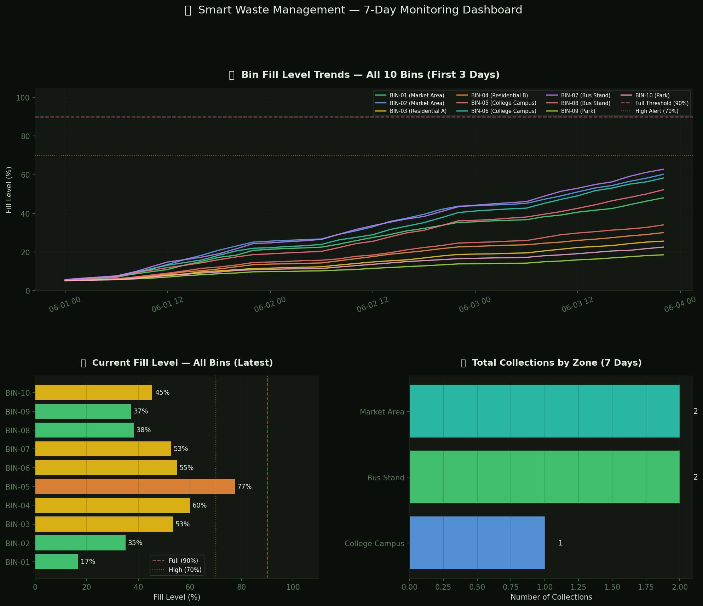
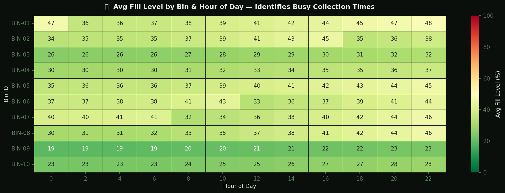
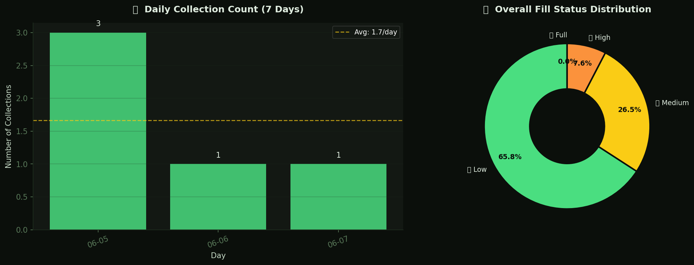
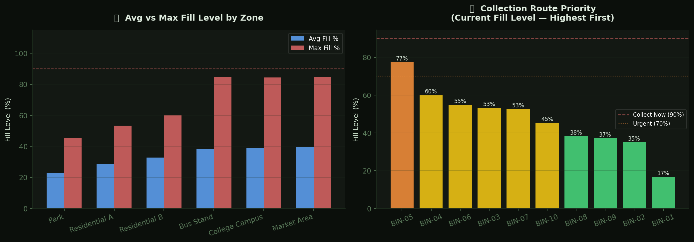

# 🗑️ Smart Waste Management Dashboard

## 📌 Project Overview

This project simulates an IoT-based Smart Waste Management System for monitoring waste bin fill levels across multiple city zones.

The system tracks bin utilization, predicts collection priorities, analyzes fill trends, identifies busy collection periods, and generates collection reports through interactive dashboards.

---

## 🚀 Features

- Smart Bin Fill Level Monitoring
- Multi-Zone Waste Tracking
- Collection Route Prioritization
- Fill Level Trend Analysis
- Collection Frequency Monitoring
- Zone-wise Waste Analytics
- Smart Collection Alerts
- Heatmap-Based Collection Planning
- Automated Dashboard Reporting

---

## 🛠 Technologies Used

- Python
- Pandas
- NumPy
- Matplotlib
- Seaborn

---

## 📊 Dashboard Preview

### Main Monitoring Dashboard

### Fill Level Heatmap

### Collection Status Analysis

### Zone Priority Dashboard

---

## 📁 Project Files

- smart_waste_management_simulation.py
- waste_bin_data.csv
- chart1_waste_dashboard.png
- chart2_hourly_heatmap.png
- chart3_collections_status.png
- chart4_zone_priority.png

---

## 🗑️ Monitored Parameters

- Bin Fill Percentage
- Collection Priority
- Collection Frequency
- Zone Utilization
- Waste Generation Trends
- Daily Collection Count
- Maximum Fill Levels
- Average Fill Levels

---

## 📍 Monitored Zones

- Market Area
- Residential Area A
- Residential Area B
- College Campus
- Bus Stand
- Park

---

## 🚨 Alert Conditions

- High Fill Level (>70%)
- Critical Fill Level (>90%)
- Collection Required
- Route Priority Triggered

---

## 📈 Dashboard Insights

- Highest Priority Collection Bins
- Collection Frequency Analysis
- Zone-wise Waste Generation
- Fill Level Distribution
- Peak Collection Hours
- Waste Accumulation Trends

---

## 🔮 Future Improvements

- Real-Time Ultrasonic Sensor Integration
- ESP32-Based Smart Bins
- GPS Route Optimization
- Mobile Application Support
- Cloud-Based Monitoring
- AI Waste Collection Prediction
- Smart City Integration

---

## 👨‍💻 Author

Aditya
